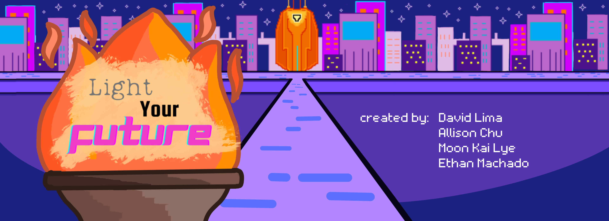
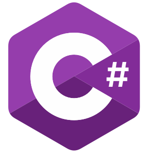

# Light Your Future 🔥

Hi :) Welcome to Light Your Future. 

*A fun mini game where you get to travel through time collecting money and facing obstacles just as you would during those different eras.*

## hello...you🧢

- 🎮  [the game](#the-game)
- ⚙️ [the tech](#technologies-we-used)
- 🌟 [the inspo](#our-inspiration)
- 😀 [the people](#about-us)

## the game
first of all! let's get straight to it. play LYF here -> [Light Your Future](https://allisonchuu.github.io/lightyourfuture/game.html)

second of all! 

 Light Your Future(LYF)🔥 is an awesome mini game where you can travel through time avoiding the Plague 🐀, Covid-19 🦠, and Blackholes 🕳️ to collect money on your way to the future!

Each level in LYF is won by reaching that time's best innovation! Whether that be the wheel🔘, the light bulb💡, the world wide web🌐, or the next big thing❓

Playing LYF is easy! just use your arrow kets to move and space bar to jump ⌨

Emjoy the game player! Discover the next big thing 🚀 

## our insipration

Our team 👥 used inspiration from HackMerced VII's theme *Light the Future* to creat LYF. We wanted to provide an interactive way to show the different time periods human beings have gone through to ge to the present 🕰️. By showcasing different obstacles in each era faced we can show a bit of history in our game.

## technologies we used

    

## about us

*Get to know more about the team behind Light Your Future!*

- 🐶 Allison Chu - "Hi! I'm a current student at University of California, Riverside, studying Neuroscience with a Computer Science Minor. I have a passion for web design and front-end development. Fun Fact: I have a cute pup named Morty(ig:@mortythemaltipoo)"