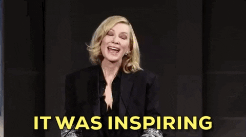

# Light Your Future 🔥

Hi :) Welcome to Light Your Future. 

*A fun mini game where you get to travel through time collecting money and face different obstacles on your way to the future.*

 

## hello...you🧢

**Navigate Here**
- 🎮  [the game](#the-game)
- 🌟 [the inspo](#our-inspiration)
- ⚙️ [the tech](#technologies-we-used)
- 😀 [the people](#about-us)

 

## 🎮 the game
**first of all!** let's get straight to it. play LYF here -> [Light Your Future](https://www.lightyourfuture.tech)

**second of all!** 

 Light Your Future(LYF)🔥 is an awesome mini game where you can travel through time avoiding the Plague 🐀, Covid-19 🦠, and Blackholes 🕳️ to collect resources on your way to the future!

Each level in LYF is won by reaching that time's best innovation! Whether that be the wheel🔘, the light bulb💡, the world wide web🌐, or the next big thing❓

Playing LYF is easy! just use your arrow keys to move and space bar to jump ⌨

**Enjoy the game player! Discover the next big thing** 🚀 

 

## 🌟 our inspiration

Light Your Future was created for UC Merced's 36hr hackathon HackMerced! Each of us had an awesome time brainstorming ideas focused around HackMerced's tracks. As well as being involved in different aspects of the project.

Our team 👥 was inspired by HackMerced VII's theme *Light the Future* and track *Open Innovation* to create LYF. We wanted to provide an interactive way to show the different time periods human beings have gone through to get to the present 🕰️. By showcasing different obstacles in each era faced, we were able to show a bit of history in our game. 

At the end of every level there is an innovation of that time period you have to reach to move onto the next level. As engineers we are capable of creating new technologies to change the way people live everyday and our game shows those new technologies.

Our team had a blast working together to create our game. We each were able to teach each other a little bit of our individual skills, so all of us were able to make the most out of this weekend.

### for the future 🔮

We plan to create new levels to emulate different time periods in our history where new innovation happened. When new technologies come out in our day and age we want to mirror that in our mini game. 

We also hope to incorporate a character selection portion to our game to allow players of all shapes and sized to be represented in our game.

 

## ⚙️ technologies we used

*Learning new technologies is fun...most of the time*🥲

    

- **HTML/CSS and Javascript** - Our team used these tools to build and style our website that hosts the Unity WebPlayer. HTML/CSS were used to style each page, and Javascript was used to make our landing page interactive. 

- **Unity/C#** - Our game was made using Unity and C# scripting and then exported into a web player format to be included into our website.

- **Procreate/PixilArt** - Our team was able to create most of the graphics seen in LYF with Procreate and PixilArt.

 

## 😀 about us

*Get to know more about the team behind Light Your Future!*

- 🐶 **Allison Chu** - "Hi! I'm a current student at University of California, Riverside, studying Neuroscience with a Computer Science Minor. I have a passion for web design and front-end development. I contributed to this project by helping build the website and create the money/obstacle icons in the game. Fun Fact: I have a cute pup named Morty(ig:@mortythemaltipoo)"